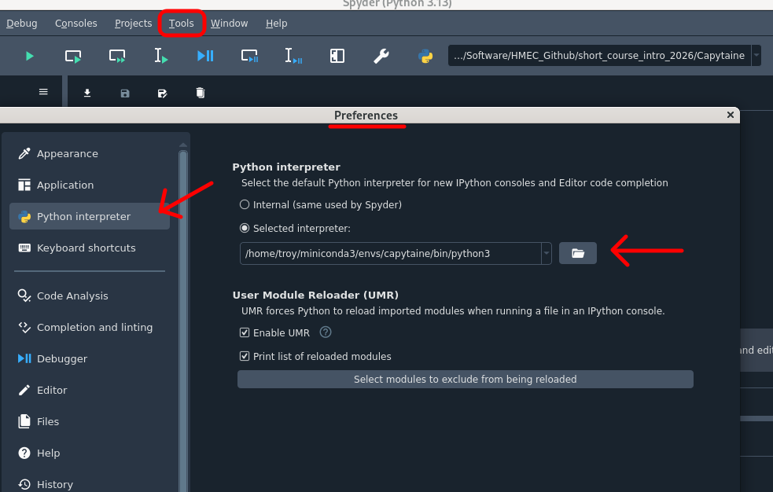
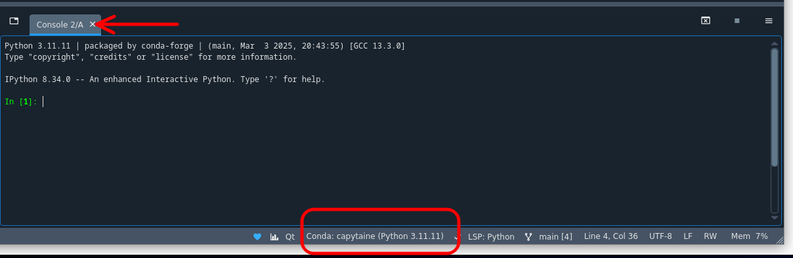

Capytaine is an open-source boundary element method (BEM) solver used to analyze the interaction between ocean waves and floating bodies. It computes key hydrodynamic coefficients such as added mass, radiation damping, wave excitation forces, and hydrostatic properties that form the foundation for modeling wave energy converters, offshore structures, and other marine systems.

Unlike computational fluid dynamics (CFD) software, Capytaine uses potential flow theory to efficiently predict wave-body interactions, making it well suited for early-stage design studies and hydrodynamic analysis.

## Capytaine Environment
In this course, we will use a dedicated Conda environment named ++"capytaine"++ to manage the Python packages required for Capytaine. Using an isolated environment helps avoid conflicts between package versions and keeps the numerical modeling workflow self-contained and reproducible.

!!! warning "Is Conda Installed?"
    If Conda has not yet been installed, refer to the [Miniconda setup](https://hmec-uh.github.io/work_environments/python/conda/) instructions before proceeding.

!!! warning "Is Spyder Installed?"
    If Spyder has not yet been installed, refer to the [Spyder IDE](https://hmec-uh.github.io/work_environments/python/spyder_ide/) instructions before proceeding.

!!! warning "Mesh Created?"
    It is assumed that you have generated a mesh (e.g., [Gmsh](../Gmsh/gmsh.md#gmsh)) and defined the ++"capytaine"++ environment. 

To start, open a terminal and activate your ++"capytaine"++ environment:

    conda activate capytaine

As a reminder, you should see the environment name to the left of your terminal command prompt:

{#terminal-env}

*Figure 1: Active terminal environment.*

Using the [Conda package manager](https://capytaine.org/stable/user_manual/installation html#installing-with-conda-package-manager), install Capytaine with

    conda install --channel conda-forge capytaine 

!!! note "Optional Packages"
    The [Capytaine docs](https://capytaine.org/stable/user_manual/installation html#installing-with-conda-package-manager) also point out a few optional packages you can install:

        conda install --channel conda-forge jupyter matplotlib vtk

    The packages above are not required for Capytaine itself, but they are commonly used for notebook workflows, plotting, and visualization.

To later connect this environment to Spyder, install the Spyder kernel package:

    conda install spyder-kernels

This package allows Spyder to execute Python code using the interpreter and packages installed within the ++"capytaine"++ environment rather than the default Conda environment.

Your ++"capytaine"++ environment should now be ready for use. In the next section, we will configure Spyder to use this environment so that Capytaine and its dependencies are available directly within the development environment.

## Spyder Configuration

Next we need to launch the [Spyder IDE](https://hmec-uh.github.io/work_environments/python/spyder_ide/). In this course, Spyder is installed in a separate Conda environment named ++"spyder"++. Keeping the development environment separate from project-specific environments avoids duplicate installations and allows Spyder to be reused across multiple projects. Other approaches are possible, including installing Spyder directly into each project environment or using a system-wide installation.

Launch a new terminal, but keep the previous one active in case you need to later install additional programs in your ++"capytaine"++ environment. If you followed along with the [Spyder IDE](https://hmec-uh.github.io/work_environments/python/spyder_ide/) installation, you should also have a ++"spyder"++ virtual environment. Activate this environment **in your new terminal**:

    conda activate spyder

Launch Spyder by executing:

    spyder

Once Spyder is up and running, we can configure it to use the Python interpreter associated with the ++"capytaine"++ environment. This allows Spyder to execute code using the packages installed within that environment, including Capytaine and other scientific computing libraries.

To configure the interpreter:

1. Open `Tools > Preferences > Python Interpreter`
2. Select `Selected Interpreter`
3. Browse to the Python executable associated with the ++"capytaine"++ environment

{#spyder-set-env}

*Figure 2: Point to Python interpreter in ++"capytaine"++ environment.*

After applying the change, close the current IPython console by clicking the ++"X"++ on the console tab. Spyder should automatically start a new console using the interpreter from the ++"capytaine"++ environment.

{#spyder-active-env}

*Figure 3: Active newly defined interpreter.*

You can confirm the active interpreter by looking at the bottom of the window. It should say ++"capytaine"++ like in Figure 3 above. You can also verify the Capytaine installation directly from the IPython console:

    import capytaine as cpt
    cpt.__version__

If a version number is returned without errors, Spyder is successfully connected to the ++"capytaine"++ environment.

## Configuration
Create a new Python script in the Spyder editor. As mentioned previously, Spyder automatically inserts a template that includes a section enclosed by triple quotes ("""). This area is commonly used to provide a brief description of the script, document its purpose, record authorship information, or include other notes that may be helpful to future users.

Begin by importing the necessary packages, modules, and functions that will be needed later in the code

