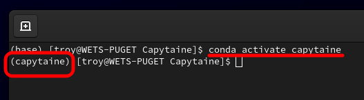

Meshmagick is an open-source tool for manipulating and analyzing surface meshes used in marine hydrodynamics. It provides utilities for inspecting, modifying, and preparing meshes representing ships, floating structures, and other marine bodies. Common operations include translating and rotating meshes, checking and correcting mesh geometry, converting between mesh file formats, and evaluating hydrostatic properties.

While Capytaine is primarily a boundary element method (BEM) solver for calculating hydrodynamic coefficients and wave-body interactions, Meshmagick focuses on the geometry and hydrostatic properties of the body itself. The two tools therefore complement one another: Meshmagick can be used to prepare and position a floating-body mesh before that mesh is used for a hydrodynamic analysis in Capytaine.

For this course, our primary use of Meshmagick will be to perform a hydrostatic analysis of our floating body. Given the body's mass and center of gravity, we will use Meshmagick to determine its equilibrium position in the water. This will allow us to establish the correct floating position of our mesh before proceeding with the Capytaine hydrodynamic analysis.

## Capytaine Environment
In this course, we will use a dedicated Conda environment named ++"capytaine"++ to manage the Python packages required for both Meshmagick and Capytaine. Using an isolated environment helps avoid conflicts between package versions and keeps the numerical modeling workflow self-contained and reproducible.

!!! warning "Is Conda Installed?"
    If Conda has not yet been installed, refer to the [Miniconda setup](https://hmec-uh.github.io/work_environments/python/conda/) instructions before proceeding.

The ++"capytaine"++ environment should already have been created before beginning this lesson. To start, open a terminal and activate the environment:

    conda activate capytaine

As a reminder, you should see the environment name to the left of your terminal command prompt:

{#terminal-env}

*Figure 1: Active terminal environment.*

## Meshmagick Installation
The Meshmagick [installation instructions](https://lheea.github.io/meshmagick/install/install.html) recommend installing the package directly from its source-code repository using ++"pip"++. We will follow this approach, but clone the repository using HTTPS rather than SSH so that GitHub SSH authentication is not required.

Before cloning Meshmagick, navigate to a location **outside of the course lesson repository**. you can store the Meshmagick source code in your ++"Documents"++ directory:

  
Windows

    cd %USERPROFILE%\Documents

  
Linux

    cd ~/Documents

!!! warning "Do Not Clone Meshmagick Inside the Course Repository"
    Meshmagick is itself a Git repository. To keep the course repository and the Meshmagick source code separate, make sure you are not inside the course lesson repository before continuing.

Clone the Meshmagick repository using HTTPS:

    git clone https://github.com/LHEEA/meshmagick.git

This creates a new directory named ++"meshmagick"++. Move into that directory:

    cd meshmagick

**With the ++"capytaine"++ Conda environment still active**, install Meshmagick using

    pip install -e .

The -e option installs Meshmagick in editable mode. Rather than copying the package into the Conda environment, Python references the source files in the cloned ++"meshmagick"++ repository. You should therefore keep this directory after the installation is complete.

### Gmsh File Support
In this course, we will use Meshmagick to work with meshes created using Gmsh. To allow Meshmagick to read the Gmsh ++".msh"++ file format, we also need to install the `gmshparser` Python package.

With the **++"capytaine"++ environment still active**, install `gmshparser` using `pip`:

    pip install gmshparser

This installs `gmshparser` into the same Conda environment as Meshmagick. Meshmagick can then use the package when reading meshes saved in the Gmsh file format.

### Verify the Installation
To verify the installation, run

    meshmagick --help

If the installation was successful, Meshmagick should display its command-line options and usage information.

You can also confirm that Meshmagick is available to Python with

    python -c "import meshmagick; print(meshmagick.__file__)"

Meshmagick is now installed within the ++"capytaine"++ environment and is ready for use in the hydrostatic analysis.