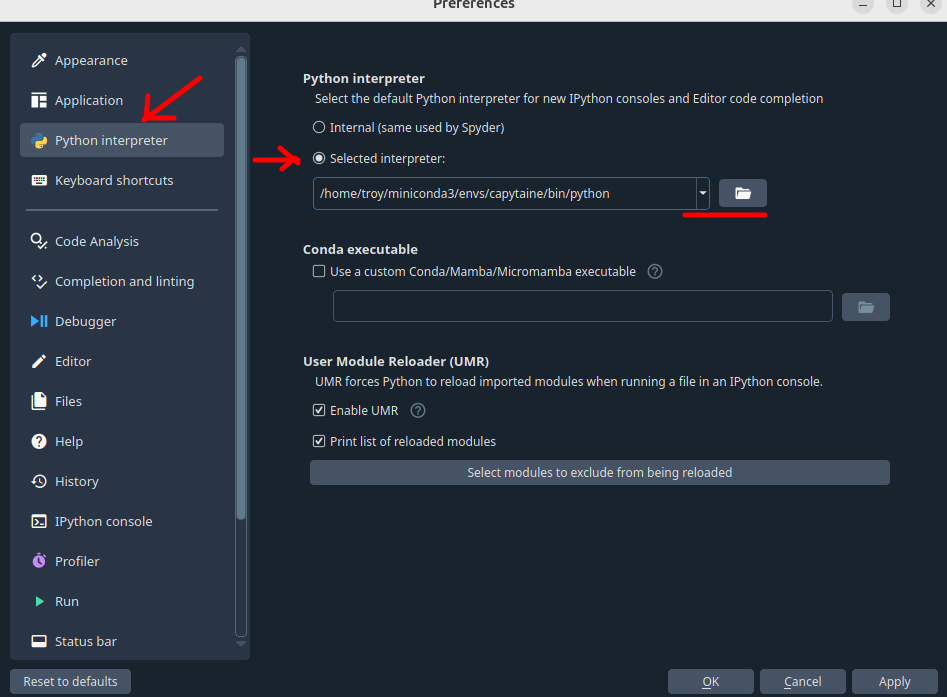
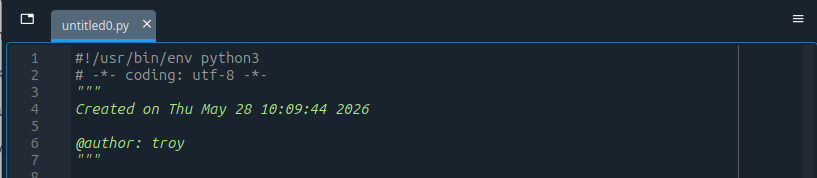
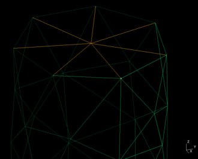
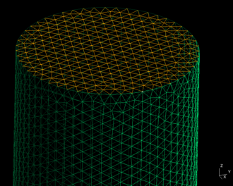
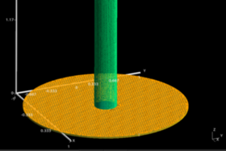
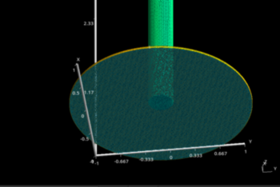
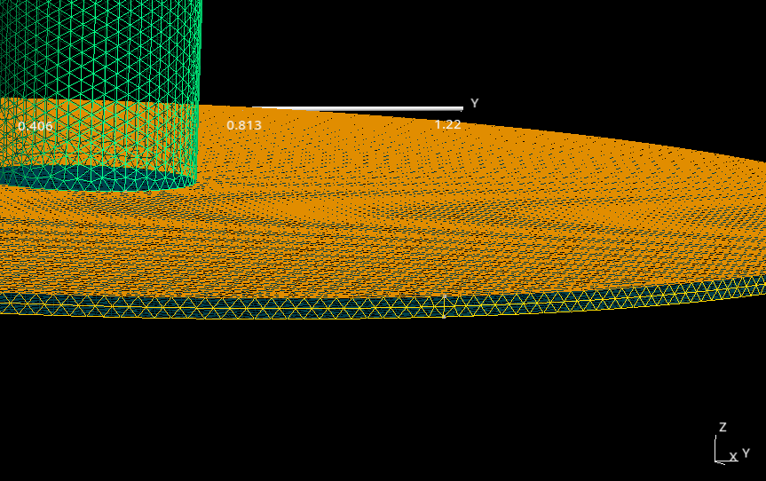
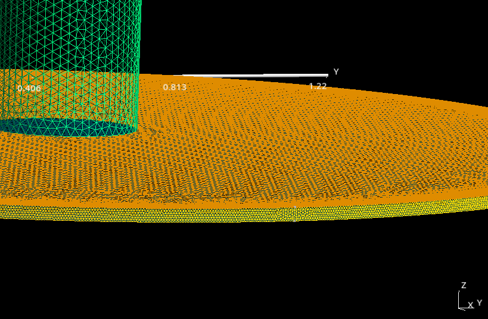
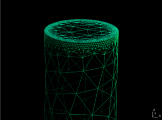
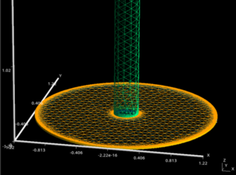

The goal of the instructions below is to introduce practical mesh generation workflows in Gmsh for hydrodynamic analysis with Capytaine using the Gmsh Python API. Rather than reproducing the full Gmsh user manual, this section focuses on the concepts and workflows most relevant to marine energy applications, including creation of simple parametric meshes that can be integrated directly into Python-based simulation workflows, as well as construction of basic non-parametric geometries entirely from code. The objective is to develop a practical foundation for building and modifying computational meshes while developing intuition for how geometry discretization influences numerical hydrodynamic models.

# Gmesh
In this course, we will use a dedicated Conda environment named ++"capytaine"++ to manage the Python packages required for Capytaine and Gmsh. Using an isolated environment helps avoid conflicts between package versions and keeps the numerical modeling workflow self-contained and reproducible.

!!! warning "Is Conda Installed?"
    If Conda has not yet been installed, refer to the earlier [Miniconda setup](../environment/python.md#miniconda) instructions before proceeding.

!!! note "Conda ++"channel"++"
    After entering Conda commands, you will be prompted with a yes/no to proceed. Herein, I'm going to assume you say "yes" and everything goes smoothly — fingers crossed!

We will start by creating a new Conda environment:

    conda create -n capytaine python=3.11

This command creates a new environment named ++"capytaine"++ with Python 3.11 installed.

It is worth pausing for a moment to appreciate what just happened. Rather than manually downloading libraries, configuring paths, or resolving conflicting package versions, Conda manages the required software stack for you. Installing Python packages through Conda not only installs the requested package itself, but also the supporting libraries required for the associated numerical workflow. We will continue to see this pattern throughout the course — dependencies are automatically handled by Conda, the package manager.

With the new environment created, we need to **activate** it:

    conda activate capytaine

You should now see ++"capytaine"++ in parenthesis leading your command prompt.

Once activated, install Gmsh from the ++conda-forge++ channel:

    conda install -c conda-forge gmsh

Gmsh should now be installed!

!!! note "Conda ++"channel"++"
    A Conda **channel** is similar to an app store that hosts software packages. Different channels serve different purposes, and ++conda-forge++ is a large community-maintained channel widely used in scientific computing and engineering workflows. Many open-source numerical modeling tools are distributed and updated through ++conda-forge++, making it the preferred source for packages such as Gmsh and Capytaine.

Gmsh includes a Python [Application Programming Interface (API)](https://gmsh.info/doc/texinfo/gmsh.html#Gmsh-application-programming-interface), which allows geometry creation, mesh generation, refinement, and export operations to be performed directly from Python code. In this course, we will primarily interact with Gmsh through this API rather than through the graphical user interface. This approach allows mesh generation to become part of larger computational workflows that can be automated, parameterized, and integrated directly with Capytaine simulations.

The [Spyder IDE](../environment/python.md#spyder-ide) was introduced previously in the Python setup instructions. To allow Spyder to interface with our ++"capytaine"++ environment, we first need to install the appropriate communication kernels inside the ++"capytaine"++ environment:

    conda install spyder-kernels

Once installed, open a **new command prompt** window and activate the separate ++"spyder"++ environment created earlier:

    conda activate spyder

Launch the Spyder IDE by typing:

    spyder

Once Spyder is running, we can configure it to use the Python interpreter associated with the ++"capytaine"++ environment. This allows Spyder to execute code using the packages installed within that environment, including Gmsh and other scientific computing libraries.

To configure the interpreter:

1. Open ++"Tools → Preferences → Python Interpreter"++
1. Select ++"Selected interpreter"++
1. Browse to the Python executable associated with the ++"capytaine"++ environment

{#python-interp}
*Figure 1: Select python interpreter from environment.*

The interpreter path will depend on the operating system and Conda installation location. For example:

  
Windows

    C:\Users\troy\miniconda3\envs\capytaine\python.exe

  
Linux

    /home/troy/miniconda3/envs/capytaine/bin/python

After applying the changes, restart the Spyder console if prompted. Spyder should now be running directly from the ++"capytaine"++ environment.

We are now ready to begin creating computational mesh models in Gmsh using the Python API. Throughout the remainder of this section, geometry creation, mesh generation, refinement, and export operations will all be performed directly from Python code.

## Parametric Model
The layout of the Spyder IDE is very similar to MATLAB. It includes a History pane, Variable Explorer, Command Window, and Editor, among other tools. We will not spend much time discussing the IDE itself, as these features are best explored through use. For now, the most important component is the Editor, which is where we will write and execute our Python scripts.

When a new Python script is created, Spyder automatically inserts a template that includes a section enclosed by triple quotes (`"""`). This area is commonly used to provide a brief description of the script, document its purpose, record authorship information, or include other notes that may be helpful to future users. There is no strict format, so you are free to organize this section however you prefer.

{#new-script}
*Figure 2: Spyder's default script template.*

!!! warning "Commenting Your Scripts"
    Comments are one of the most important tools available to an engineer or scientist. They should be written with the intended audience in mind and used to explain what the code is doing. A well-commented script can serve as both documentation and an educational resource for future users—including yourself several months from now. Throughout this course, examples will intentionally include more comments than would typically be found in production code so that the purpose of each step is clear to new users.

The first thing I recommend doing in any Python script is importing the packages, modules, and functions that will be needed later in the code. By convention, imports are typically placed at the beginning of the script so that dependencies are easy to identify and manage.

For this introductory example, we will only be using the Gmsh Python API, which can be imported with:

    import gmsh

This statement tells Python to load the ++gmsh++ package and make its functionality available within the script. Because Gmsh was installed earlier through Conda, Python knows where to find the package within the active ++"capytaine"++ environment. If Python is unable to import the package, something is likely wrong with the environment setup or Spyder is not configured to use the interpreter associated with the correct environment.

As our examples become more sophisticated, additional packages such as NumPy, Matplotlib, and Capytaine will be imported in a similar manner.

One important concept to understand is that simply importing the `gmsh` package does not start a Gmsh session. Before any geometry can be created, the Gmsh API must first be initialized:

    # ------------------------------------------------------------
    # 1. Initialize Gmsh
    # ------------------------------------------------------------
    # This starts the Gmsh Python API. It must be called before using
    # any Gmsh functions.
    gmsh.initialize()

This command starts the Gmsh engine and prepares it to receive geometry, meshing, and file I/O commands.

!!! note "Start/Stop Gmsh"
    Most Gmsh scripts begin with `gmsh.initialize()` and end with `gmsh.finalize()`, which properly closes the session when the script is complete.

With the API now launched, we will start by giving our model a name:
    
    # Give the model a name. This is useful when working with
    # multiple geometries or when inspecting output files.
    gmsh.model.add("spar_buoy")

Before creating the geometry, it is worth noting that there are multiple ways to build models in Gmsh. One approach is to construct the geometry from the ground up by explicitly defining points, connecting those points with curves, assembling curves into surfaces, and finally combining surfaces into volumes. This **"bottom-up"** approach provides a great deal of flexibility, but it can become tedious for even moderately complex geometries.

In this section, we will primarily use the OpenCASCADE geometry kernel and its built-in geometric primitives for a **"top-down"** approach. Rather than explicitly defining every point and connection, we can create common geometric objects such as cylinders, boxes, spheres, and cones using a small number of parameters. These primitives can then be combined and modified through operations such as unions, intersections, cuts, and other Boolean operations to create more complex geometries. This allows us to focus on the meshing workflow itself before exploring more advanced geometry construction techniques.

We can now define the parameters describing our spar geometry. Although the cylinder in this example is quite simple, it is good practice to define key dimensions as variables rather than embedding numerical values directly throughout the code. This makes the model easier to read, modify, and extend. For example, changing the spar radius or draft later only requires updating a single variable rather than searching through the entire script.

The OpenCASCADE ++"addCylinder()"++ function requires:

* the coordinates of the center of one circular face,
* a vector defining the cylinder axis and length,
* and the cylinder radius.

!!! warning "Units"
    Although Gmsh itself is **unitless**, engineering software rarely is. Since our ultimate goal is to use these meshes within Capytaine, we will adopt SI units throughout this course. Consequently, all lengths defined below should be interpreted as meters.

!!! warning "Reference Frame"
    It is useful to think of the geometry being created in its own **local** coordinate reference frame. The cylinder is defined relative to the origin of your choice in the Gmsh model, but its final position and orientation within a simulation can be modified later via translations and rotations. Separating geometry definition from placement is a common modeling practice and helps keep mesh generation and simulation setup independent.

We therefore begin by defining those quantities explicitly:

    # ------------------------------------------------------------
    # 2. Define cylinder parameters
    # ------------------------------------------------------------
    # For this first example, we define a simple vertical cylinder
    # representing a spar. All dimensions are specified in meters.
    #
    # The cylinder axis will point in the positive z-direction.
    
    spar_radius = 0.165      # Cylinder radius [m] (0.165 m ~ 6.5 in)
    spar_height = 6.096      # Cylinder height [m] (6.096 m ~ 20 ft)
        
    # The cylinder is defined by:
    #   - the center of the first circular face: (x, y, z)
    #   - an axis vector: (dx, dy, dz)
    #   - a radius
    #
    # Here, the first circular face is centered at z = 0,
    # and the cylinder extends upward to z = spar_height.
    #
    # These coordinates define the geometry within a local
    # reference frame whose origin is located at (0, 0, 0).
    
    spar_x0 = 0.0
    spar_y0 = 0.0
    spar_z0 = 0.0
    
    spar_dx = 0.0
    spar_dy = 0.0
    spar_dz = spar_height

With the geometric parameters defined, we can now create the spar geometry. Recall that we are using a top-down modeling approach, so rather than defining points, curves, and surfaces individually, we will create the entire cylinder directly from the parameters specified above. The OpenCASCADE geometry kernel provides an ++"addCylinder()"++ function for this purpose:

    # ------------------------------------------------------------
    # 3. Create the cylinder geometry
    # ------------------------------------------------------------
    # Gmsh includes multiple geometry kernels. Here we use the
    # OpenCASCADE kernel, accessed through gmsh.model.occ.
    #
    # addCylinder returns an integer tag identifying the new volume.
    
    cylinder = gmsh.model.occ.addCylinder(
        spar_x0, spar_y0, spar_z0,
        spar_dx, spar_dy, spar_dz,
        spar_radius
    )

At this point, the cylinder has been created within the OpenCASCADE geometry kernel, but it is not yet available to the rest of the Gmsh model. Gmsh separates geometry creation from the main model representation, allowing multiple geometric operations to be performed efficiently before updating the model. Before we can generate a mesh or perform further operations, we must therefore synchronize the OpenCASCADE geometry with the main Gmsh model:

    # ------------------------------------------------------------
    # 4. Synchronize the geometry
    # ------------------------------------------------------------
    # After creating geometry with the OpenCASCADE kernel, we must
    # synchronize it with the main Gmsh model before meshing.
    
    gmsh.model.occ.synchronize()

With the **geometry** now synchronized, we can specify how finely the surface should be **discretized**. In general, smaller **mesh** elements provide a more accurate **representation** of the **geometry**, but they also increase the computational cost of the simulation. Larger elements reduce the number of panels and computational effort, but may not capture geometric features adequately. For this introductory example, we will use a uniform mesh size across the entire geometry:

    # ------------------------------------------------------------
    # 5. Set mesh size
    # ------------------------------------------------------------
    # This controls the approximate size of mesh elements.
    # Smaller values create a finer mesh; larger values create
    # a coarser mesh.
    
    mesh_size = 0.02
    
    gmsh.option.setNumber("Mesh.CharacteristicLengthMin", mesh_size)
    gmsh.option.setNumber("Mesh.CharacteristicLengthMax", mesh_size)

The geometry now exists within the Gmsh model and a target mesh size has been specified. The next step is to **discretize** the **continuous** geometry into a collection of finite elements that can be used for numerical analysis.

Recall that Capytaine uses a Boundary Element Method (BEM), which only requires a **discretization** of the body surface rather than the entire volume. We therefore generate a surface mesh by specifying a mesh dimension of 2:

    # ------------------------------------------------------------
    # 6. Generate the mesh
    # ------------------------------------------------------------
    # We will be most interested in the surface (2) mesh of the body rather than
    # the full volume (3) mesh.
    
    gmsh.model.mesh.generate(2)

The argument passed to `generate()` specifies the dimension of the entities to be meshed:

* `generate(1)` meshes curves (lines and edges)
* `generate(2)` meshes surfaces
* `generate(3)` meshes volumes

If `generate(3)` were used instead, Gmsh would create a volume mesh by filling the cylinder with three-dimensional elements. Such meshes are commonly used in finite element (FEA) and computational fluid dynamics (CFD) simulations, but are unnecessary for Capytaine, which only requires a watertight surface representation of the body.

The **mesh** has now been generated and exists in memory within the Gmsh model. To make use of the mesh in other programs such as Capytaine, we need to save it to a file on disk.

By default, Gmsh writes files relative to the current **working directory**, which is the folder from which the script is being executed. In Spyder, the current **working directory** is displayed near the top of the window and can be changed if desired. For now, we will simply write the mesh to a file named "spar_buoy.msh" in the current **working directory**:

    # ------------------------------------------------------------
    # 7. Write the mesh to a file
    # ------------------------------------------------------------
    # The .msh format is Gmsh's native mesh format.
    
    gmsh.write("spar_buoy.msh")

Recall that we initialized the Gmsh API near the beginning of the script using `gmsh.initialize()`. Once all geometry creation, meshing, and file operations are complete, it is good practice to properly close the Gmsh session:

    # ------------------------------------------------------------
    # 8. Finalize Gmsh
    # ------------------------------------------------------------
    # This closes the Gmsh API session.
    
    gmsh.finalize()

While small scripts will often terminate successfully without explicitly finalizing Gmsh, including `gmsh.finalize()` helps ensure that resources are released properly and is considered good practice for larger workflows.

!!! success "Congratulations!"
    You have just created your first computational mesh using the Gmsh Python API.

The cylinder may not look particularly exciting, but it represents an important milestone: you have successfully transformed a **continuous** geometric description into a **discrete** computational model suitable for numerical analysis. Everything that follows — from more complex geometries to hydrodynamic simulations in Capytaine — will build upon the same workflow introduced here.

{#mesh_coarse}  {#mesh_fine}

*Figure 3: Comparison of coarse `mesh_size` (left) vs fine `mesh_size` (right) for spar.*

## Boolean Construction
In the previous section, we completed the numerical fabrication of our spar buoy. The next logical question is: How do we create more complex geometries?

<figure class="align-right">
  
  <figcaption>Figure 4: Full spar mesh.</figcaption>
</figure>

In this section, we will build upon the spar buoy shown in Figure 4 by adding a heave plate using Boolean operations. In doing so, we will introduce a powerful set of geometry manipulation tools while continuing to leverage the flexibility and reproducibility of parametric modeling.

!!! note "Heave Plate Geometry"
    A heave plate does not need to be circular. The geometry was selected for instructive purposes.
    
From a geometric perspective, a heave plate can be represented using another simple cylinder primitive. Therefore, we can leverage the same techniques introduced previously to create the heave plate and then use a Boolean **union** operation to merge it with the spar geometry. The result is a single continuous body that can be meshed and analyzed as a single structure.

For brevity, we will skip the detailed discussion of defining the second cylinder and focus instead on the new concepts introduced by Boolean operations. Assuming the geometric parameters for both the spar and heave plate have already been defined, we first create the two geometric primitives:

    # ------------------------------------------------------------
    # 3. Create geometric primitives
    # ------------------------------------------------------------
    # We use the OpenCASCADE geometry kernel through gmsh.model.occ.
    # The addCylinder function creates a cylinder primitive from:
    #   - the center of the first circular face,
    #   - an axis vector,
    #   - and a radius.
    #
    # Each call returns an integer tag identifying the new volume.
    
    spar_buoy = gmsh.model.occ.addCylinder(
        spar_x0, spar_y0, spar_z0,
        spar_dx, spar_dy, spar_dz,
        spar_radius
    )
    
    heave_plate = gmsh.model.occ.addCylinder(
        heave_x0, heave_y0, heave_z0,
        heave_dx, heave_dy, heave_dz,
        heave_radius
    )

At this point, the spar and heave plate exist as two completely independent geometric volumes. If meshed now, they would be treated as separate objects. To combine them into a single body, we perform a Boolean **union** operation:

    # ------------------------------------------------------------
    # 4. Combine primitives using a Boolean union
    # ------------------------------------------------------------
    # The spar and heave plate were created as two separate volumes.
    # To mesh them as one continuous body, we combine them using a
    # Boolean union operation.
    #
    # Gmsh refers to volume entities using dimension-tag pairs:
    #   (3, spar_buoy)    -> 3D volume associated with the spar
    #   (3, heave_plate)  -> 3D volume associated with the heave plate
    #
    # The fuse operation returns the resulting combined geometry.
    
    combined_body, _ = gmsh.model.occ.fuse(
        [(3, spar_buoy)],
        [(3, heave_plate)]
    )

!!! note "Object History"
    By default, `gmsh.model.occ.fuse()` removes the original objects after creating the fused result. So after the union, the original spar and heave plate volumes are replaced by the new combined volume.

Notice that the Boolean operation only modifies the geometry construction phase of the workflow. Once the combined body has been created, the remaining steps — synchronization, mesh generation, file export, and finalization — are identical to those presented in the previous example.

{#heave_top}  {#heave_bottom}

*Figure 5: Top (left) and bottom (right) of heave plate mesh.*

The result of the Boolean **union** operation is shown in Figure 5. Notice that the top face is divided into multiple regions by the boundary between the heave plate (orange) and the spar (green). Gmsh displays these faces using different colors, indicating that they are separate entities within the model. In contrast, the bottom face of the heave plate (blue) does not intersect any other face and therefore remains a single entity. This subdivision is a common consequence of Boolean operations and is one of the ways Gmsh tracks the topology of the resulting geometry.

## Local Mesh Refinement
In the previous sections, we applied a single global mesh size to the entire model. This is a useful starting point, but it does not always produce an ideal mesh. Different regions of a geometry may have very different characteristic length scales. For example, the spar is long and slender, while the heave plate is wide but extremely thin. A mesh size that adequately represents the spar may provide too few elements through the thickness of the heave plate.

{#heave_edge}

*Figure 6: Mesh resolution along heave plate thickness.*

TThis matters because Capytaine uses the mesh as the geometric surface over which the hydrodynamic boundary value problem is solved. If important geometric features are represented by too few panels, the resulting hydrodynamic coefficients may become less accurate, particularly at higher frequencies where shorter wavelengths must be resolved.

Rather than refining the entire model, a more efficient strategy is to apply local mesh refinement only where additional resolution is needed. In our case, we would like to refine the mesh near the outer edge of the heave plate while keeping the remainder of the model relatively coarse.

Previously, mesh size was controlled globally using:

    # ------------------------------------------------------------
    # 6. Set mesh size
    # ------------------------------------------------------------
    # This controls the approximate size of mesh elements.
    # Smaller values create a finer mesh; larger values create
    # a coarser mesh.
    
    mesh_size = 0.02
    
    gmsh.option.setNumber("Mesh.CharacteristicLengthMin", mesh_size)
    gmsh.option.setNumber("Mesh.CharacteristicLengthMax", mesh_size)

To allow the mesh density to vary spatially, Gmsh provides **mesh fields**. A mesh field is simply a mathematical rule that prescribes the desired element size as a function of position. By defining a mesh field relative to the outer edge of the heave plate, we can generate smaller elements near that feature and gradually transition to larger elements elsewhere.

The first step is therefore to identify the geometric entities that define the outer edge of the heave plate. Since the geometry was created through a Boolean operation, we cannot assume that a particular curve will always be assigned the same entity tag. Instead, we must identify the appropriate curves based on their geometric properties.

    # ------------------------------------------------------------
    # 6. Identify reference curves for local refinement
    # ------------------------------------------------------------
    # To define a local mesh refinement region, we first identify the
    # outer circular curves of the heave plate. These curves will be
    # used as the reference geometry for a distance-based mesh field.
    
    tol = 1e-6
    outer_edge_curves = []
    
    for dim, tag in gmsh.model.getEntities(1):
    
        # Get the bounding box of the curve.
        xmin, ymin, zmin, xmax, ymax, zmax = gmsh.model.getBoundingBox(dim, tag)
    
        # Compute the bounding-box dimensions.
        dz = zmax - zmin
        dx = xmax - xmin
        dy = ymax - ymin
    
        # The outer heave-plate curves lie in horizontal planes.
        is_horizontal_curve = dz < tol
    
        # The outer circular curves span the heave-plate diameter.
        is_outer_radius = (
            abs(dx - 2 * heave_radius) < 1e-4 or
            abs(dy - 2 * heave_radius) < 1e-4
        )
    
        # The relevant curves are located at the bottom and top
        # elevations of the heave plate.
        is_at_heave_top_or_bottom = (
            abs(zmin - heave_z0) < 1e-4 or
            abs(zmin - (heave_z0 + heave_height)) < 1e-4
        )
    
        # Store the curve tag if all geometric criteria are satisfied.
        if is_horizontal_curve and is_outer_radius and is_at_heave_top_or_bottom:
            outer_edge_curves.append(tag)

Now that we have identified the curves defining the outer edge of the heave plate, we can use them as a reference for local mesh refinement.

    # ------------------------------------------------------------
    # 7. Local mesh refinement
    # ------------------------------------------------------------
    # We use a background mesh field to refine the mesh near the outer
    # heave-plate edge while allowing the mesh to become coarser away
    # from that region.
    
    # 7a) Define mesh sizes
    # Use approximately 5 elements through the heave-plate thickness.
    mesh_size = 0.02
    heave_mesh_size = heave_height / 5

The overall strategy is straightforward. First, we define a Distance field that measures the distance from any location in the model to the selected heave-plate edge curves. On its own, this field simply provides a geometric distance measurement and does not influence the mesh.

    # 7b) Distance field
    # The Distance field computes distance from selected geometric
    # entities. Here, distance is measured from the outer heave-plate
    # curves identified above.
    distance_field = gmsh.model.mesh.field.add("Distance")
    
    # For curved entities, Gmsh approximates the distance calculation
    # using sampled points along the curve. We choose a sampling value
    # based on the desired fine mesh size around the heave-plate perimeter.
    N_pts = math.ceil((2 * heave_radius * math.pi) / heave_mesh_size)
    gmsh.model.mesh.field.setNumber(distance_field, "Sampling", N_pts)
    gmsh.model.mesh.field.setNumbers(distance_field, "CurvesList", outer_edge_curves)

Next, we define a Threshold field, which converts that distance into a desired mesh size. Locations close to the heave-plate edge will receive a smaller mesh size, while locations farther away will gradually transition back to the global mesh size. Together, these two fields allow us to create a localized refinement region without manually specifying mesh sizes on individual surfaces or curves.

    # 7c) Threshold field
    # The Threshold field converts distance into a target mesh size.
    # Points close to the selected curves use SizeMin, points far from
    # the curves use SizeMax, and points between DistMin and DistMax
    # transition gradually between those values.
    threshold_field = gmsh.model.mesh.field.add("Threshold")
    
    gmsh.model.mesh.field.setNumber(threshold_field, "InField", distance_field)
    gmsh.model.mesh.field.setNumber(threshold_field, "SizeMin", heave_mesh_size)
    gmsh.model.mesh.field.setNumber(threshold_field, "SizeMax", mesh_size)
    gmsh.model.mesh.field.setNumber(threshold_field, "DistMin", heave_height)
    gmsh.model.mesh.field.setNumber(threshold_field, "DistMax", 5 * heave_height)

A few additional remarks regarding the mesh generation options are warranted. We need to prevent Gmsh from automatically propagating small mesh sizes defined on boundary curves across entire adjacent surfaces. During development of this example, leaving this option enabled caused the fine mesh resolution applied near the outer edge of the heave plate to spread across the entire bottom face, giving unnecessary resolution. By disabling this behavior, the refinement remains localized to the region defined by the mesh field.

    # 7d) Mesh generation options
    # Prevent Gmsh from extending small boundary mesh sizes across entire
    # adjacent surfaces. This helps keep refinement localized near the
    # heave-plate edge instead of spreading across the full top and bottom
    # faces of the plate.
    gmsh.option.setNumber("Mesh.MeshSizeExtendFromBoundary", 0)
    
    # Optional advanced controls:
    # These can be disabled if you want the background field to dominate
    # the mesh-size calculation without additional point- or curvature-based
    # refinement.
    #
    # gmsh.option.setNumber("Mesh.MeshSizeFromPoints", 0)
    # gmsh.option.setNumber("Mesh.MeshSizeFromCurvature", 0)

Lastely, we need to instruct Gmsh to use the Threshold field as the active mesh-size map during mesh generation. Up to this point, we have merely defined the Distance and Threshold fields. This final command tells Gmsh to actually use those fields when constructing the mesh.

    # 7e) Activate the background mesh field
    # The threshold field now defines the target mesh size throughout
    # the model.
    gmsh.model.mesh.field.setAsBackgroundMesh(threshold_field)

The remainder of the workflow is unchanged from the previous examples. Once the background mesh field has been established, we proceed with mesh generation, file export, and finalization exactly as before.

{#heave_edge_fine}

*Figure 7: Local mesh refinement along heave plate thickness.*

Compared to Figure 6, Figure 7 shows the resulting mesh provides additional resolution near the outer edge of the heave plate while allowing the remainder of the geometry to remain relatively coarse. This targeted refinement strategy helps improve geometric fidelity where it is needed most without unnecessarily increasing the overall panel count.

## Advanced Local Mesh Refinement

{#adv_spar}  {#adv_heave}

*Figure 8: Advanced local mesh refinement of spar (left) and heave plate (right).*

It is worth noting that this additional refinement may not ultimately be necessary. In engineering analysis, mesh density should be driven by the accuracy requirements of the simulation rather than by a desire to create the finest mesh possible.

Later, when working with Capytaine, we will compare the performance of different mesh resolutions through a **grid convergence** study. By comparing hydrodynamic results obtained from progressively finer meshes, we can determine whether additional refinement meaningfully affects the solution. It may turn out that the relatively coarse mesh used in the previous example is already sufficient, and that further refinement of the heave-plate edge has little impact on the quantities of interest.

Nevertheless, this example serves as a useful introduction to local mesh refinement and demonstrates how mesh fields can be used to selectively increase resolution in regions where additional geometric fidelity may be required.

