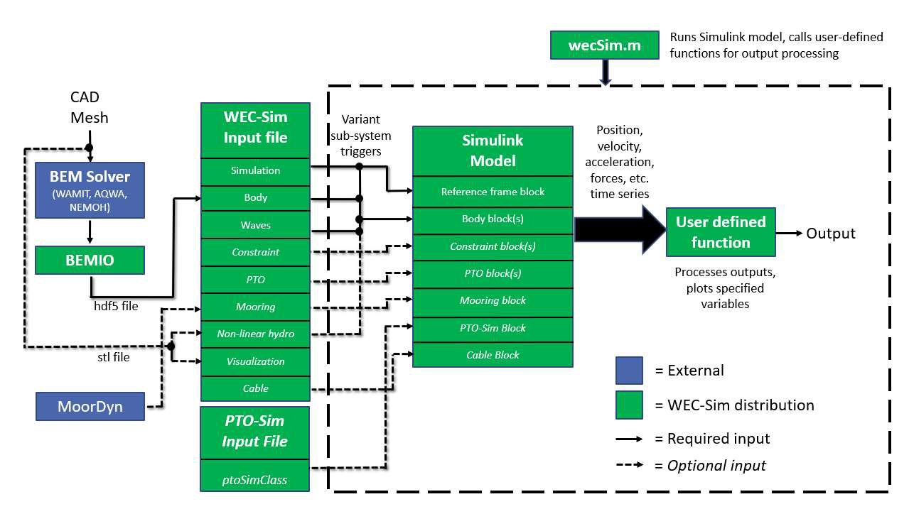
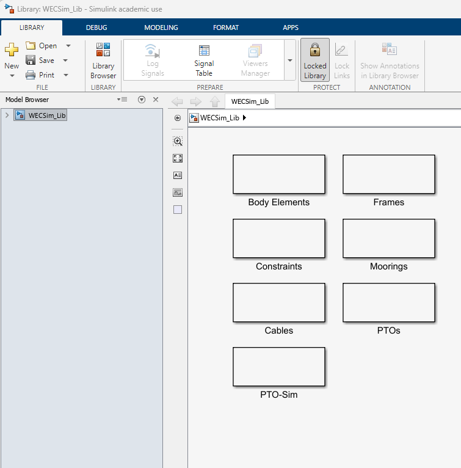
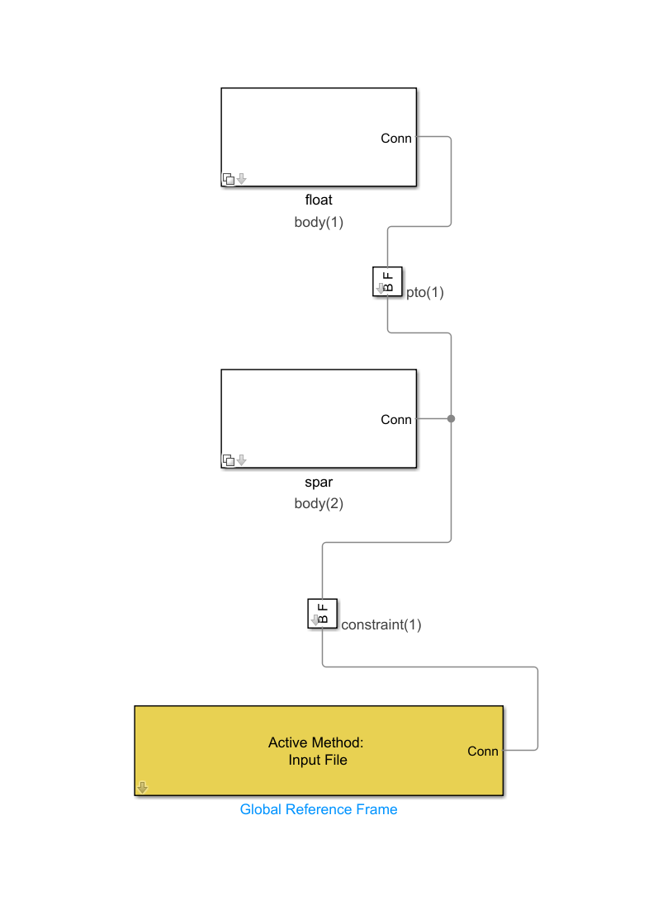

## Background – What is WEC-Sim?

- Simulates wave energy converter dynamics in operational waves

- Time-domain rigid body equation of motion solver based on Cummin’s formulation

- Open-source software developed in MATLAB/Simulink

  - Available at <https://github.com/WEC-Sim/WEC-Sim>

- Joint NLR/Sandia project funded by the US Department of Energy

- First Release: v1.0 in June 2014

- Current Release: v7.1.0 in June 2026

Why use WEC-Sim?

- WEC-Sim can model devices comprised of bodies, joints, power take-off systems, and mooring systems. WEC-Sim can model rigid, varying, and flexible bodies with generalized body modes.

- WEC-Sim uses hydrodynamic coefficients derived from frequency-domain boundary element (BEM) simulations to model the relevant hydrodynamics.

Dynamics simulated by solving the time-domain equation of motion (Cummins, 1962)

$$
m\ddot{x}(t)=F_{hs}(t)+F_{ext}(t)+F_{rad}(t)+F_v(t)+F_{PTO}(t)+F_m(t)+F_{nh}(t)
$$


{#img}

*Figure 1: General roadmap to using WEC-Sim.*

## Step 1 — Copy (or create) necessary files
For convenience, you can download RM3 geometry and hydrodata files here:

[Download RM3 files here](WEC-Sim_workshop_files.zip)

(if files do not download immediately, click "view RAW" and files should download)

Unzip the folder and put the geometry and hydroData folders in your working directory.

These files can also be found in:

...\WEC-Sim\examples\RM3


## Step 2 — Create a Simscape model with the WEC-Sim library

We want to build a simple Simscape model with rigid bodies, constraints, moorings, and PTOs.

Open Simscape and use the WEC-Sim library to build the simple RM3 model.

(Note that the body numbers must match the order in the hydrodata file.)

{#img1}

*Figure 2: WEC-Sim Library.*

The RM3 is comprised of:

- two rigid bodies (float and spar/plate)

- one 3DOF constraint

- one translational PTO

- a Global Reference Frame


{#img2}

*Figure 3: WEC-Sim Reference Model #3 (RM3) - Heave Point Absorber.*

Save this file as "RM3.slx"

## Step 3 — Create a WEC-Sim Input File

Now that we understand the geometry and hydrodynamic data, we can begin building the WEC-Sim model.

The primary configuration file is:

wecSimInputFile.m

This file tells WEC-Sim what we want to simulate.

At a high level, the input file defines:

Simulation

↓

Environment

↓

Bodies

↓

Joints

↓

PTOs

We will introduce these sections one at a time.

------------------------------------------------------------------------

## Step 4 — Define the Simulation

The first object we create is the WEC-Sim simulation object.

A basic input file begins with:

```matlab

%% Simulation Data

simu = simulationClass();

simu.simMechanicsFile = 'RM3.slx';

simu.startTime = 0; %defines the initial time of the simulation (usually 0)
simu.rampTime = 100; %waves will slowly ramp up to a defined value up to this time.

simu.endTime = 400; %defines the duration of the simulation

simu.dt = 0.1; %defines the timestep in the simulation

```

The exact values can be changed later.

For now, the important idea is that simulationClass contains the parameters controlling the simulation.

------------------------------------------------------------------------

## Step 5 — Define the Environment

Next, define the wave environment.

Create an environment object

wave classes can be defined for many wave types:

```matlab

waves = waveClass(‘regular’); % Regular waves. treats radiation coefficients as constant values pulled from BEM data at a single excitation frequency

waveClass('noWaveCIC'); %no waves with radiation CIC

waveClass('regularCIC'); %Regular Waves with convolution integral calculation for radiation forces and infinite-frequency added mass

waveClass('irregular'); %Irregular Waves using PM Spectrum

waves.spectrumType = 'PM'; % Specify Wave Spectrum Type

waves.spectrumType = 'JS';

waves.direction=[0];

waveClass('spectrumImport'); % Create the Wave Variable and Specify Type

waves.spectrumFile = 'spectrumData.mat'; % Name of User-Defined Spectrum File [:,2] = [f, Sf]

```
For an initial test, use a regular wave:

```matlab

%% Wave information

waves = waveClass(‘regularCIC’);

waves.height = 2;

waves.period = 8;
```

At this stage, don't worry about creating realistic sea states.

The purpose of this first simulation is simply to verify that the WEC-Sim model works.

------------------------------------------------------------------------

## Step 6 — Define the RM3 Bodies

Now we can define the two bodies.

Create a body object for the float:

```matlab

%% Body 1: Float

body(1) = bodyClass('hydroData/rm3.h5');

% Links hydrodata to body(1). body 1 in hydrodata will be assigned to body(1) in simulink. 

body(1).geometryFile = 'RM3_Float.stl'; % assigns the float geometry to body(1)
```

Then define the spar:
```matlab

%% Body 2: Spar

body(2) = bodyClass('hydroData/rm3.h5');

% Links hydrodata to body(2). body 2 in hydrodata will be assigned to body(2) in simulink. 

body(2).geometryFile = 'RM3_Spar.stl'; % assigns the spar geometry to body(1)
```

At this point, WEC-Sim knows the geometry and hydrodynamics of the two bodies. We can also input the physical properties such as mass and inertia.
```matlab
body(1).mass = 'equilibrium';

% Body Mass. The 'equilibrium' Option Sets it to the Displaced Water Weight.

body(1).inertia = [20907301 , 21306090.66 , 37085481.11]; % Moment of Inertia [kg\*m^2]

body(2).mass = 'equilibrium';

body(2).inertia = [94419614.57 , 94407091.24 , 28542224.82];
```
------------------------------------------------------------------------

## Step 7 — Define Joints with constraints (NOT THE PTO)

The constraint object describes how the device moves in the water. We want to define the DOF of the device at the center of rotation. Usually a device will only require one constraint object for the body **as a whole**, while other joints for relative motion are modeled as a spring-damper using the PTO object.

```matlab

%% Floating (3DOF) Joint

constraint(1) = constraintClass('Constraint1'); % Initialize Constraint Class for Constraint1

constraint(1).location = [0 0 0]; % Constraint Location [m]
```

The joint definition determines which degrees of freedom are allowed and which are constrained.

For the RM3, the important motion is the relative motion between the float and spar.

At this point, we are still only describing the hydrodynamic system.

We have not yet introduced the PTO.

------------------------------------------------------------------------

## Step 8 — Define the PTO

In a simple model, the PTO can be modeled as a simple spring-damper.

Create a PTO object and define its location:
```matlab

pto(1) = ptoClass('PTO1'); % Initialize PTO Class for PTO1

pto(1).location =[0 0 0]; % PTO Location [m]
```

Now assign a damping and stiffness to the PTO
```matlab

pto(1).stiffness = 0; % PTO Stiffness [N/m]

pto(1).damping = 1200000; % PTO Damping [N/(m/s)]
```

(If we want to model the spar/float as a simple translation joint without damping, we can set the damping to 0.)

------------------------------------------------------------------------

## Step 9 — Run wecSim and observe results

In the command window, type “ wecSim ”

The simulation should run and a Mechanics Explorer should open with an animation of the spar/float.

If a file titled “userDefinedFunctions.m” exists in the same folder, WEC-Sim will run that file after the simulation is finished. This file can be used for post-processing the data.

```matlab
%% userDefinedFunctions.m

%Example of user input MATLAB file for post processing

%Plot waves

waves.plotElevation(simu.rampTime);

try

waves.plotSpectrum();

catch

end

%Plot heave response for body 1

output.plotResponse(1,3);

%Plot heave response for body 2

output.plotResponse(2,3);

%Plot heave forces for body 1

output.plotForces(1,3);

%Plot heave forces for body 2

output.plotForces(2,3);

%Save waves and response as video

% output.saveViz(simu,body,waves,...

% 'timesPerFrame',1,'axisLimits',[-150 150 -150 150 -50 20],...

% 'startEndTime',[100 150]);
```
